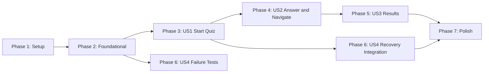

---

description: "Implementation task list for the AI Powered Technical Quiz App"
---

# Tasks: AI Powered Technical Quiz App

**Input**: Design documents from `/specs/001-technical-quiz-app/`

**Prerequisites**: `plan.md` and `spec.md`; supporting decisions in `research.md`, `data-model.md`, `contracts/quiz-api.md`, `quickstart.md`, and `.specify/memory/constitution.md`

**Tests**: Required. The feature specification and constitution require deterministic unit, component, API, browser, and accessibility coverage without a live Google API key. Write each story's listed tests first and observe the intended failure before its implementation tasks.

**Organization**: Tasks are grouped by user story so each increment can be implemented and verified independently. The implementation plan's stateless Express API and server-only Google key supersede the older browser-key statements in the PRD.

## Path Conventions

- Shared contracts: `packages/contracts/src/` and `packages/contracts/tests/`
- API: `backend/src/` and `backend/tests/`
- React client: `frontend/src/` and `frontend/tests/`
- Browser tests: `frontend/tests/e2e/`

## Phase 1: Setup (Shared Infrastructure)

**Purpose**: Create the strict TypeScript npm workspace and developer tooling for the static client, stateless API, and shared contract package.

- [X] T001 Create the npm workspace manifest with root dev, test, lint, typecheck, build, accessibility, and provider-smoke scripts in `package.json`
- [X] T002 Configure strict TypeScript project references and shared compiler defaults in `tsconfig.base.json`, `tsconfig.json`, `frontend/tsconfig.json`, `backend/tsconfig.json`, and `packages/contracts/tsconfig.json`
- [X] T003 [P] Initialize the shared contracts package and its build entry points in `packages/contracts/package.json` and `packages/contracts/src/index.ts`
- [X] T004 [P] Bootstrap the React/Vite/Tailwind client, including its GitHub Pages base configuration, in `frontend/package.json`, `frontend/vite.config.ts`, `frontend/tailwind.config.ts`, `frontend/postcss.config.js`, and `frontend/index.html`
- [X] T005 [P] Bootstrap the Express/TypeScript API package and development entry points in `backend/package.json`, `backend/tsconfig.json`, and `backend/src/server.ts`
- [X] T006 [P] Configure repository linting and formatting in `eslint.config.js` and `.prettierrc.json`
- [X] T007 [P] Configure the Vitest workspace, React test environment, and Playwright base projects in `vitest.workspace.ts`, `frontend/tests/setup.ts`, and `playwright.config.ts`
- [X] T008 [P] Protect local secrets and add placeholder-only environment examples in `.gitignore`, `frontend/.env.example`, and `backend/.env.example`
- [X] T009 Install the declared workspace dependencies and commit the reproducible dependency graph in `package-lock.json`

**Checkpoint**: The workspace installs successfully and each package has a strict TypeScript, lint, test, and production-build entry point.

---

## Phase 2: Foundational (Blocking Prerequisites)

**Purpose**: Establish shared contracts, secure API scaffolding, and typed application seams required by every user story.

**Critical**: Complete this phase before beginning story implementation.

- [X] T010 [P] Define the nine-topic allowlist and internal 4/4/2 quiz distribution in `packages/contracts/src/topics.ts`
- [X] T011 [P] Define provider-facing and learner-safe quiz, option, result, and error TypeScript models in `packages/contracts/src/quiz.ts`
- [X] T012 [P] Define strict Zod request, learner-safe response, and safe error-envelope schemas, then export them from `packages/contracts/src/schemas.ts` and `packages/contracts/src/index.ts`
- [X] T013 Write allowlist and schema tests, including reusable valid and invalid ten-question payload fixtures, in `packages/contracts/tests/topics.test.ts`, `packages/contracts/tests/schemas.test.ts`, and `packages/contracts/tests/fixtures/quizPayloads.ts`
- [X] T014 [P] Implement typed backend environment parsing, generation limits, route deadline, and rate-limit configuration in `backend/src/config/env.ts` and `backend/src/config/limits.ts`
- [X] T015 [P] Define the injectable LangChain provider port and internal safe operational-error types in `backend/src/provider/types.ts` and `backend/src/api/errors.ts`
- [X] T016 Implement the Express baseline with JSON size limits, exact-origin CORS, per-IP rate limiting, request IDs, and sanitized error serialization in `backend/src/app.ts` and `backend/src/api/middleware/*.ts`
- [X] T017 Implement the non-sensitive health route and API startup wiring in `backend/src/api/health.ts` and `backend/src/server.ts`
- [X] T018 [P] Implement typed frontend environment access and a safe client error model in `frontend/src/config/env.ts` and `frontend/src/services/errors.ts`
- [X] T019 [P] Define the discriminated application state, action union, and initial reducer shell in `frontend/src/app/state.ts` and `frontend/src/app/reducer.ts`
- [X] T020 Implement provider construction through dependency injection so API tests can replace the live adapter in `backend/src/provider/createProvider.ts` and `backend/src/app.ts`

**Checkpoint**: Shared contracts reject invalid inputs, `/health` exposes no sensitive configuration, and both client and API have typed state/error boundaries without persistence.

---

## Phase 3: User Story 1 - Start a Focused Technical Quiz (Priority: P1)

**Goal**: Let a learner select exactly one supported topic, create one complete valid quiz through the API, and arrive at its first question without exposing internal difficulty or provider details.

**Independent Test**: With a mocked provider returning a valid ten-question set, render all nine topics, verify Start Quiz is disabled before selection, start one selected topic, observe accessible loading, and confirm the first question opens only after complete-set validation.

### Tests for User Story 1

- [X] T021 [P] [US1] Write prompt composition and complete-set semantic-validation tests in `backend/tests/quiz/prompt.test.ts` and `backend/tests/quiz/validateQuiz.test.ts`
- [X] T022 [P] [US1] Write mocked-provider generation pipeline tests for learner-safe mapping and all-or-nothing rejection in `backend/tests/quiz/generateQuiz.test.ts`
- [X] T023 [P] [US1] Write Supertest success and invalid-request contract tests for `POST /api/quiz/generate` in `backend/tests/api/generateQuiz.test.ts`
- [X] T024 [P] [US1] Write typed client generation-request and learner-safe response-revalidation tests in `frontend/tests/services/quizApi.test.ts`
- [X] T025 [P] [US1] Write topic selection and accessible loading-state tests, including the absence of difficulty text, in `frontend/tests/pages/TopicSelectionPage.test.tsx` and `frontend/tests/pages/GeneratingPage.test.tsx`

### Implementation for User Story 1

- [X] T026 [P] [US1] Implement the stable system instruction and topic-specific structured quiz request in `backend/src/quiz/prompt.ts`
- [X] T027 [P] [US1] Implement whitespace normalization, prompt fingerprinting, full-set distribution/type checks, option-reference checks, bounded content checks, and learner-safe mapping in `backend/src/quiz/normalization.ts` and `backend/src/quiz/validateQuiz.ts`
- [X] T028 [P] [US1] Implement the server-only `ChatGoogle` LangChain structured-output adapter using `GOOGLE_API_KEY` and `GOOGLE_MODEL` in `backend/src/provider/chatGoogle.ts`
- [X] T029 [US1] Implement complete-set generation orchestration that invokes the provider and rejects invalid output as a whole in `backend/src/quiz/generateQuiz.ts`
- [X] T030 [US1] Implement the validated topic controller and `POST /api/quiz/generate` route using the injected generator in `backend/src/api/quizRoutes.ts` and `backend/src/app.ts`
- [X] T031 [P] [US1] Implement the typed client API request that sends only an allowlisted topic and revalidates the received learner-safe quiz in `frontend/src/services/quizApi.ts`
- [X] T032 [US1] Build the accessible application shell, semantic landmarks, focus baseline, and responsive global styles in `frontend/src/main.tsx`, `frontend/src/App.tsx`, and `frontend/src/styles/index.css`
- [X] T033 [US1] Implement the single-select topic control and disabled-until-selected Start Quiz screen in `frontend/src/pages/TopicSelectionPage.tsx`
- [X] T034 [P] [US1] Implement the topic-aware generation status screen with a polite live region and no internal composition details in `frontend/src/components/LoadingState.tsx` and `frontend/src/pages/GeneratingPage.tsx`
- [X] T035 [US1] Extend the reducer and app orchestration with topic replacement, request-ID duplicate suppression, and valid-response session initialization in `frontend/src/app/reducer.ts` and `frontend/src/App.tsx`
- [X] T036 [US1] Render the initial question prompt and learner-safe option data without displaying difficulty in `frontend/src/components/QuestionCard.tsx` and `frontend/src/pages/QuizPage.tsx`
- [X] T037 [US1] Run and fix only the User Story 1 tests in `backend/tests/quiz/prompt.test.ts`, `backend/tests/quiz/validateQuiz.test.ts`, `backend/tests/quiz/generateQuiz.test.ts`, `backend/tests/api/generateQuiz.test.ts`, `frontend/tests/services/quizApi.test.ts`, and `frontend/tests/pages/TopicSelectionPage.test.tsx`

**Checkpoint**: A valid mocked response produces exactly one initialized quiz at question one; no invalid or partial response reaches the learner.

---

## Phase 4: User Story 2 - Answer, Navigate, and Complete the Quiz (Priority: P1)

**Goal**: Let a learner answer, skip, revisit, and change questions while the client preserves stable shuffled options and blocks incomplete submission.

**Independent Test**: Load a valid fixture directly into a session, answer and revisit an item, skip another, reach the end, and verify the unresolved count blocks submission and returns focus to an unanswered question.

### Tests for User Story 2

- [X] T038 [P] [US2] Write Fisher-Yates immutability and valid-option answer-map tests in `frontend/tests/domain/shuffle.test.ts` and `frontend/tests/domain/answers.test.ts`
- [X] T039 [P] [US2] Write next, back, skip-wrap, unresolved-set, and incomplete-submit navigation tests in `frontend/tests/domain/navigation.test.ts`
- [X] T040 [P] [US2] Write keyboard-accessible quiz interaction tests for radio options, persisted selection, navigation, and submission blocking in `frontend/tests/pages/QuizPage.test.tsx`

### Implementation for User Story 2

- [X] T041 [P] [US2] Implement an immutable Fisher-Yates option shuffle and one-time session preparation routine in `frontend/src/domain/shuffle.ts`
- [X] T042 [P] [US2] Implement option-ID answer validation, answered counts, and unresolved-question selectors in `frontend/src/domain/answers.ts`
- [X] T043 [US2] Implement sequential navigation and skip-to-next-unresolved wrapping in `frontend/src/domain/navigation.ts`
- [X] T044 [US2] Extend reducer transitions for answer replacement, Back, Next, Skip, incomplete submission blocking, and immutable answer preservation in `frontend/src/app/reducer.ts`
- [X] T045 [P] [US2] Implement the progress indicator, bounded inert code block, and grouped accessible single-select answer control in `frontend/src/components/ProgressIndicator.tsx`, `frontend/src/components/CodeBlock.tsx`, and `frontend/src/components/QuestionCard.tsx`
- [X] T046 [US2] Complete Back, Skip, Next, unresolved-count, and disabled Submit Quiz behavior in `frontend/src/pages/QuizPage.tsx`
- [X] T047 [US2] Manage focus on question changes and concise live progress announcements in `frontend/src/App.tsx` and `frontend/src/pages/QuizPage.tsx`
- [X] T048 [US2] Run and fix only the User Story 2 tests in `frontend/tests/domain/shuffle.test.ts`, `frontend/tests/domain/answers.test.ts`, `frontend/tests/domain/navigation.test.ts`, and `frontend/tests/pages/QuizPage.test.tsx`

**Checkpoint**: Option order remains stable for one session, answers are always option IDs, skipped questions remain unresolved, and an incomplete attempt cannot submit.

---

## Phase 5: User Story 3 - Review a Deterministic Result (Priority: P1)

**Goal**: Score a completed quiz locally and present all ten learner-readable reviews with exactly one post-results action.

**Independent Test**: Submit a fixture with a known mixed answer pattern and verify its score, percentage, correct/incorrect counts, ten reviews, shuffled-position independence, and single Choose New Topic action.

### Tests for User Story 3

- [X] T049 [P] [US3] Write deterministic score, percentage-bound, and immutable-result snapshot tests in `frontend/tests/domain/scoring.test.ts`
- [X] T050 [P] [US3] Write results summary, ten-review, textual outcome, and one-action-only tests in `frontend/tests/pages/ResultsPage.test.tsx`
- [X] T051 [P] [US3] Write the mocked API browser flow for answer, skip, revisit, answer change, completed submission, review, and reset in `frontend/tests/e2e/quiz-flow.spec.ts`

### Implementation for User Story 3

- [X] T052 [US3] Implement local option-ID scoring, 0-to-100 percentage calculation, and immutable result construction in `frontend/src/domain/scoring.ts`
- [X] T053 [US3] Extend the reducer to submit once only, lock quiz controls after a complete submission, and clear the session on Choose New Topic in `frontend/src/app/reducer.ts`
- [X] T054 [P] [US3] Implement textual correct/incorrect review states, score metrics, learner answer lookup, and correct answer lookup in `frontend/src/components/ScoreSummary.tsx` and `frontend/src/components/QuestionReview.tsx`
- [X] T055 [US3] Implement the read-only results page with all ten reviews and only the Choose New Topic action in `frontend/src/pages/ResultsPage.tsx`
- [X] T056 [US3] Wire the results transition and return-to-topic-selection behavior in `frontend/src/App.tsx`
- [X] T057 [US3] Run and fix only the User Story 3 tests in `frontend/tests/domain/scoring.test.ts`, `frontend/tests/pages/ResultsPage.test.tsx`, and `frontend/tests/e2e/quiz-flow.spec.ts`

**Checkpoint**: Every completed attempt has a deterministic local result, a complete review, no difficulty metadata, and no retake/history/ranking action.

---

## Phase 6: User Story 4 - Recover from Generation Problems (Priority: P2)

**Goal**: Safely map generation, validation, timeout, and provider failures to accessible recovery states without exposing raw operational details or accepting stale responses.

**Independent Test**: Mock configuration, network, timeout, rate-limit, authorization, provider, malformed-response, and stale-response failures; verify a safe message, valid recovery action, and no partial quiz for every case.

### Tests for User Story 4

- [X] T058 [P] [US4] Write backend deadline, bounded retry/repair, provider-status, safe-error-envelope, and pending-request cleanup tests in `backend/tests/quiz/generateQuiz.failure.test.ts` and `backend/tests/api/generateQuiz.failure.test.ts`
- [X] T059 [P] [US4] Write client 30-second abort, safe error mapping, retry-action, and stale-response suppression tests in `frontend/tests/services/quizApi.error.test.ts` and `frontend/tests/app/App.recovery.test.tsx`
- [X] T060 [P] [US4] Write mocked browser failure flows for malformed output, timeout, rate limit, and recovery actions in `frontend/tests/e2e/recovery.spec.ts`

### Implementation for User Story 4

- [X] T061 [US4] Implement bounded exponential backoff with jitter, shared route deadline, categorized repair prompts, and terminal retry classification in `backend/src/quiz/retry.ts` and `backend/src/quiz/generateQuiz.ts`
- [X] T062 [P] [US4] Implement safe provider-error mapping, retryability, redacted request correlation, and pending-map removal in `backend/src/api/errors.ts`, `backend/src/api/quizRoutes.ts`, and `backend/src/api/middleware/requestId.ts`
- [X] T063 [P] [US4] Implement the client-side 30-second AbortController deadline, API error-envelope parsing, and safe transport error mapping in `frontend/src/services/quizApi.ts` and `frontend/src/services/errors.ts`
- [X] T064 [P] [US4] Implement an accessible alert-based recovery screen with Try Again and Choose New Topic actions in `frontend/src/components/ErrorState.tsx` and `frontend/src/pages/ErrorPage.tsx`
- [X] T065 [US4] Wire retry, return-to-topic-selection, aborted-request cleanup, and stale request-ID result rejection in `frontend/src/app/reducer.ts` and `frontend/src/App.tsx`
- [X] T066 [US4] Run and fix only the User Story 4 tests in `backend/tests/quiz/generateQuiz.failure.test.ts`, `backend/tests/api/generateQuiz.failure.test.ts`, `frontend/tests/services/quizApi.error.test.ts`, `frontend/tests/app/App.recovery.test.tsx`, and `frontend/tests/e2e/recovery.spec.ts`

**Checkpoint**: Failed generation is recoverable, clear, and non-sensitive; it never replaces the active screen with stale or partial quiz data.

---

## Phase 7: Polish and Cross-Cutting Concerns

**Purpose**: Close release gates for accessibility, responsive behavior, security, deployment, and documented validation.

- [X] T067 [P] Add primary-screen accessibility regression coverage for landmarks, headings, focus, live regions, radio groups, non-color state labels, and absent difficulty metadata in `frontend/tests/accessibility/primaryScreens.test.tsx`
- [X] T068 [P] Add 320-pixel and desktop Playwright checks for page overflow, contained inert code, keyboard flow, and responsive controls in `frontend/tests/e2e/responsive.spec.ts`
- [X] T069 [P] Add API security regression tests for strict origin handling, body validation, rate limiting, redacted errors, and no model/key exposure in `backend/tests/api/security.test.ts`
- [X] T070 Implement compatible client CSP metadata and API security headers without weakening the configured CORS boundary in `frontend/index.html`, `backend/src/app.ts`, and `backend/src/api/middleware/errorHandler.ts`
- [X] T071 [P] Implement the exact-model, redacted provider smoke command and package script in `backend/src/provider/smoke.ts` and `backend/package.json`
- [X] T072 [P] Add deterministic CI quality gates for typecheck, lint, unit/component/API/browser tests, accessibility tests, and production builds in `.github/workflows/ci.yml`
- [X] T073 [P] Add the GitHub Pages frontend deployment workflow with `VITE_API_BASE_URL` as the only client environment setting in `.github/workflows/deploy-frontend.yml`
- [X] T074 [P] Document local setup, server-side secrets, separate API deployment, no-persistence policy, and smoke-test release gate in `README.md` and `specs/001-technical-quiz-app/quickstart.md`
- [X] T075 Run the documented deterministic quality gates and the credential-dependent pre-release smoke prerequisite from `package.json` and `specs/001-technical-quiz-app/quickstart.md`

**Checkpoint**: CI is secret-free and deterministic; a release is blocked until typecheck, lint, tests, accessibility, builds, responsive checks, and the separately configured model smoke test pass.

---

## Dependencies and Execution Order

### Phase Dependencies



- **Setup (Phase 1)**: Has no dependencies.
- **Foundational (Phase 2)**: Depends on Setup and blocks implementation of all stories.
- **US1 (Phase 3)**: Starts after Foundational and supplies the loaded quiz/API seams needed by the primary learner flow.
- **US2 (Phase 4)**: Depends on US1 for an initialized session, though its pure-domain fixture tests can be written immediately after Foundational.
- **US3 (Phase 5)**: Depends on US2's answer map and submission gating.
- **US4 (Phase 6)**: Failure tests can start after Foundational; recovery integration completes after US1 establishes the generation flow.
- **Polish (Phase 7)**: Depends on all desired story work, especially the US3 browser flow and US4 recovery states.

### Parallel Opportunities

- After T001 and T002, T003 through T008 can proceed in parallel where their package/configuration files do not overlap.
- T010 through T012, T014, T015, T018, and T019 are separate foundational modules that can proceed in parallel once their package scaffolds exist.
- The test tasks marked `[P]` in each story use distinct files and can be authored concurrently before implementation tasks.
- The provider adapter, prompt builder, semantic validator, client API service, and initial shell in US1 are independent file slices after their test seams are defined.
- US4 backend and client error mapping can proceed in parallel after the shared retry policy is available.
- The Phase 7 CI, deployment, documentation, smoke command, browser, API security, and accessibility work can proceed in parallel except where they update the same configuration file.

## Parallel Example: User Story 1

```text
Task: "Write prompt composition and complete-set semantic-validation tests in backend/tests/quiz/prompt.test.ts and backend/tests/quiz/validateQuiz.test.ts"
Task: "Write mocked-provider generation pipeline tests in backend/tests/quiz/generateQuiz.test.ts"
Task: "Write Supertest success and invalid-request contract tests in backend/tests/api/generateQuiz.test.ts"
Task: "Write typed client generation-request tests in frontend/tests/services/quizApi.test.ts"
Task: "Write topic selection and loading-state tests in frontend/tests/pages/TopicSelectionPage.test.tsx and frontend/tests/pages/GeneratingPage.test.tsx"
```

## Parallel Example: User Story 2

```text
Task: "Write shuffle and answer-map tests in frontend/tests/domain/shuffle.test.ts and frontend/tests/domain/answers.test.ts"
Task: "Write unresolved navigation tests in frontend/tests/domain/navigation.test.ts"
Task: "Write quiz interaction tests in frontend/tests/pages/QuizPage.test.tsx"

Task: "Implement immutable option shuffling in frontend/src/domain/shuffle.ts"
Task: "Implement answer validation and unresolved selectors in frontend/src/domain/answers.ts"
```

## Parallel Example: User Story 3

```text
Task: "Write scoring tests in frontend/tests/domain/scoring.test.ts"
Task: "Write results page tests in frontend/tests/pages/ResultsPage.test.tsx"
Task: "Write the mocked browser flow in frontend/tests/e2e/quiz-flow.spec.ts"
```

## Parallel Example: User Story 4

```text
Task: "Write backend failure tests in backend/tests/quiz/generateQuiz.failure.test.ts and backend/tests/api/generateQuiz.failure.test.ts"
Task: "Write client recovery tests in frontend/tests/services/quizApi.error.test.ts and frontend/tests/app/App.recovery.test.tsx"
Task: "Write browser recovery tests in frontend/tests/e2e/recovery.spec.ts"

Task: "Implement safe API error mapping in backend/src/api/errors.ts and backend/src/api/quizRoutes.ts"
Task: "Implement client timeout and error mapping in frontend/src/services/quizApi.ts and frontend/src/services/errors.ts"
```

## Implementation Strategy

### MVP First

1. Complete Phase 1 and Phase 2.
2. Complete User Story 1 through T037.
3. Run the focused US1 test set with a mocked LangChain adapter.
4. Demonstrate the topic selection, loading, complete-set validation, and first-question transition before taking on navigation or results.

### Incremental Delivery

1. Add User Story 2 to make a loaded quiz fully answerable, navigable, and safely blocked while unresolved.
2. Add User Story 3 to release deterministic scoring and the complete review experience.
3. Add User Story 4 to harden generation recovery and stale-response protection.
4. Complete Phase 7 only after the learner flows pass in deterministic tests.

### Suggested Team Allocation

- One developer owns the shared contracts and Express/provider boundary through US1.
- One developer can author the pure client-domain tests and UI components for US2 after the contracts are stable.
- One developer can prepare US3 results tests and components against the ten-question fixture while US2 completes.
- One developer can prepare US4 failure tests after Foundational, then integrate recovery states once the US1 request flow exists.

## Notes

- `[P]` marks tasks that can run in parallel after their stated prerequisites and do not modify the same files.
- Story labels map directly to the four user stories in `spec.md`.
- No task introduces persistence, authentication, a database, a fallback question bank, or a client-visible provider secret.
- The live provider smoke command is intentionally separate from secret-free CI and must use the exact configured `gemma-4-26b-a4b-it` identifier without a fallback model.
